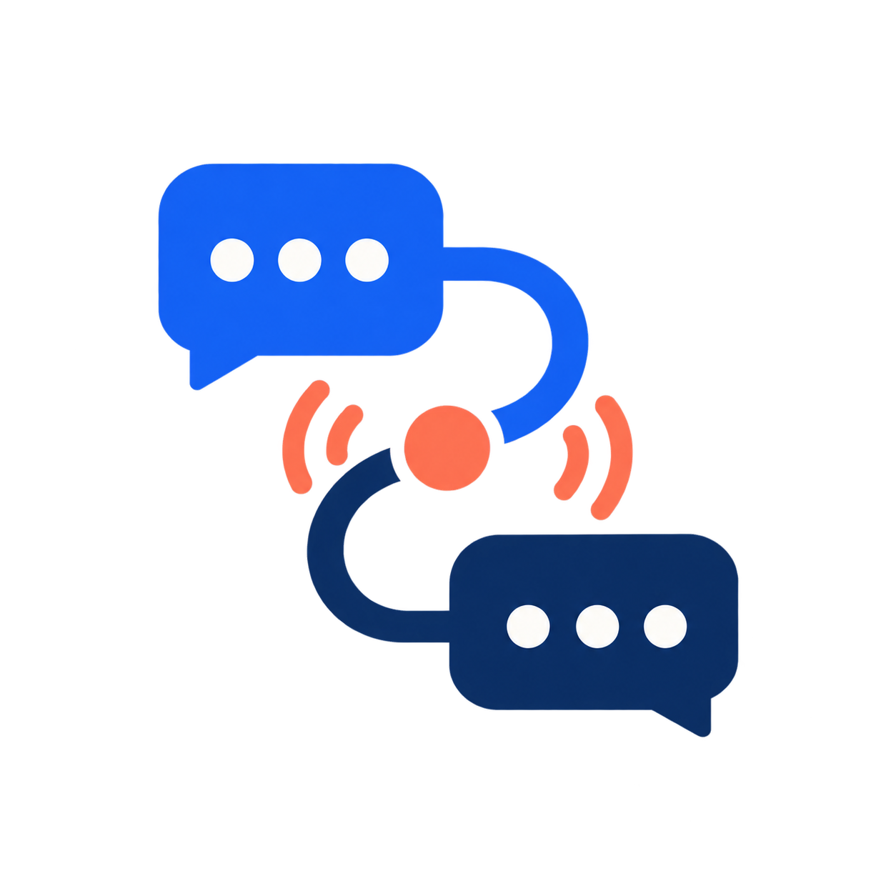
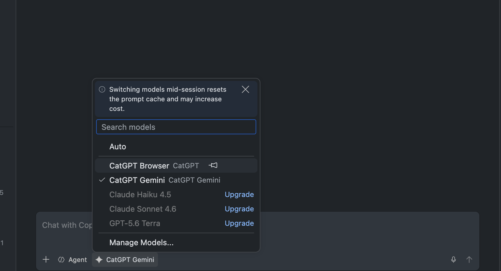
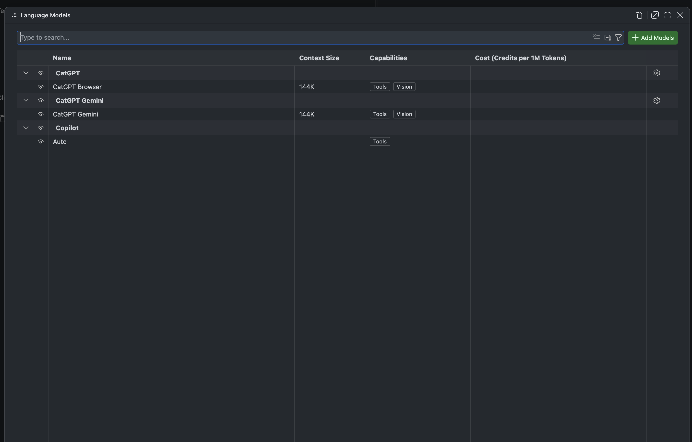
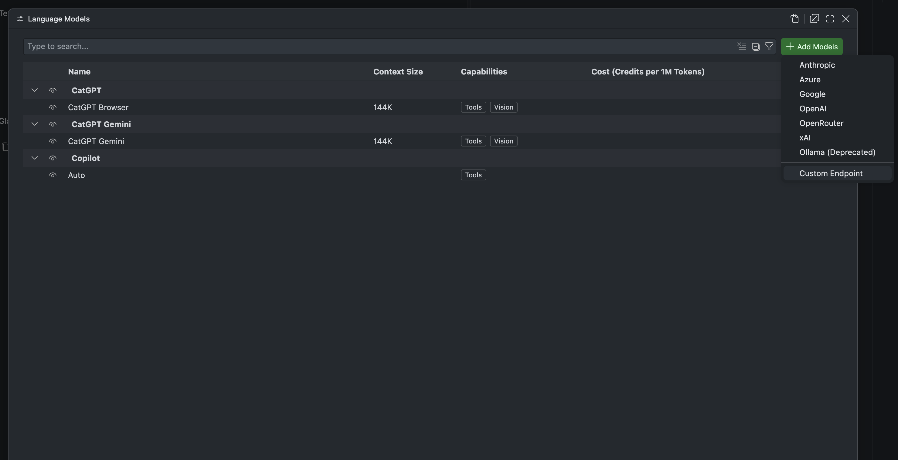
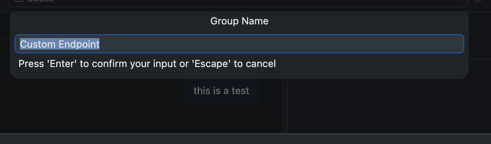
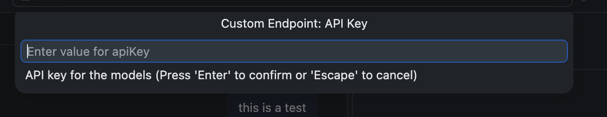
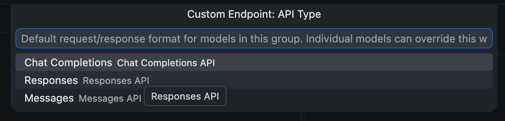

# Chat Model Relay

**A browser-backed AI gateway for ChatGPT and Gemini.**
Connect VS Code and other OpenAI-compatible clients to one persistent gateway.

[Quick Start](#quick-start) · [VS Code setup](#vs-code-setup) · [Core capabilities](#core-capabilities) · API · Environment · Setup · Architecture

---

Chat Model Relay turns a logged-in browser session into familiar API endpoints. ChatGPT and Gemini use persistent, automated browser sessions. It is designed for private, self-hosted integrations—not as an official provider API.

The core flow is simple: **VS Code or another client → Chat Model Relay gateway → persistent browser/provider → normalized API response**. VS Code is the primary target; Cursor, Cline, and other compatible clients are supported as compatibility targets and should be verified in your own setup.

## Core capabilities

- **Client-compatible API surfaces:** OpenAI-compatible endpoints let VS Code and other IDE tools connect to the configured provider. Available model IDs and capabilities depend on the provider and endpoint.
- **Persistent provider sessions:** Browser-backed ChatGPT and Gemini sessions with thread and application isolation.
- **Rich requests:** Tool calls, vision, file attachments, image generation, audio capture, and JSON Schema output for supported providers.
- **Reliable operations:** Long-prompt fallback, response normalization, health checks, configurable authentication, and Docker deployment.

> **Tip**
> Long-prompt fallback is enabled by default. If ChatGPT disables direct submission, Chat Model Relay uploads the complete request as a temporary UTF-8 attachment. This avoids freezing the browser composer, but it depends on the provider accepting file uploads and adds upload time. The flow has been validated with a 1.4-million-character request.

## Providers


| Provider | Connection         | Model                                    | Notable capabilities                                         |
| -------- | ------------------ | ---------------------------------------- | ------------------------------------------------------------ |
| ChatGPT  | Persistent browser | `catgpt-browser` or configured GPT model | Images, vision, files, audio, model/effort switching         |
| Gemini   | Persistent browser | `gemini-browser`                         | Chat, vision, files, tools (Google account login in the GUI) |


## Quick Start

### 1. Configure your checkout

```bash
# Run these commands from your Chat Model Relay checkout.
cd /path/to/chat-model-relay
```

The default Compose setup builds this checkout as `catgpt:local`, binds it to
loopback, and needs no credentials. It does not pull or publish an image.
Copy `.env.example` to `.env` and adjust the values as needed. The legacy `CATGPT_*` names remain accepted for existing installations:

```dotenv
RELAY_API_KEY=replace-me
RELAY_VNC_PASSWORD=replace-me
RELAY_USER_ID=1000
RELAY_GROUP_ID=1000
```

See the [generated environment reference](docs/ENVIRONMENT.md) for every setting and its default.

### 2. Start the container

```bash
docker compose up -d
```


| Service               | Address                 |
| --------------------- | ----------------------- |
| ChatGPT browser login | `http://localhost:5800` |
| ChatGPT API gateway   | `http://localhost:8650` |
| Gemini browser login  | `http://localhost:5801` |
| Gemini API gateway    | `http://localhost:8651` |


`docker compose up -d` starts both ChatGPT and Gemini containers from the same image. Open `http://localhost:5800` and sign in to ChatGPT. Open `http://localhost:5801` and sign in to Gemini with a Google account (2FA/passkeys are done in that GUI). Profiles persist separately under `appdata/catgpt/` and `appdata/catgpt-gemini/`. If you set `RELAY_VNC_PASSWORD`, enter it when prompted.

To run only ChatGPT: `docker compose up -d catgpt`.

Check that the gateway is ready before sending a request:

```bash
curl http://localhost:8650/healthz
```

Expect `{"status":"ok"}`.

### 3. Send a request

```bash
curl http://localhost:8650/v1/chat/completions \
  -H "Content-Type: application/json" \
  -d '{
    "model": "catgpt-browser",
    "messages": [{"role": "user", "content": "Say hello from CatGPT."}]
}'
```

`stream=true` is accepted for client compatibility, but browser generation
finishes before CatGPT emits the SSE or NDJSON chunks. It is not live token
forwarding from the provider.

The bundled Compose setup accepts local requests without a token. If you set
`RELAY_API_KEY`, include `-H "Authorization: Bearer $RELAY_API_KEY"` in each
API request. Do not expose this default setup beyond your machine. Before any
network exposure, set a strong token and set `API_TOKEN_OPTIONAL=false` so
authentication is required.

## VS Code setup

You can add Chat Model Relay as a custom language-model endpoint in VS Code. Start the Docker services and complete the one-time browser login first.

1. Open the model picker in the Chat view and choose **Manage Models**.

   

2. Choose **Add Models**.

   

3. Choose **Custom Endpoint**.

   

4. For **Group Name**, enter `Chat Model Relay — ChatGPT` or any prefered name.

   

5. For **API Key**, enter the value of `RELAY_API_KEY` from your `.env`. If authentication is optional and no key is configured, enter `dummy123` or any prefered name.

   

6. For **API Type**, choose **Chat Completions**.

   

   | Field | Value |
   |---|---|
   | Model name | `Chat Model Relay — ChatGPT` |
   | Model ID | `catgpt-browser` |
   | Base URL | `http://localhost:8650/v1` |

8. Save the model, select it in the Chat view, and send a short test message.

To add Gemini, repeat the same steps with **Group Name** `Chat Model Relay — Gemini`, **Model ID** `gemini-browser`, and **Base URL** `http://localhost:8651/v1`. Use the Gemini gateway only after signing in through `http://localhost:5801`.

If you configured `API_TOKEN_OPTIONAL=false`, the API key must match `RELAY_API_KEY`. If VS Code reports that the model is unavailable, check the matching gateway health endpoint (`http://localhost:8650/healthz` or `http://localhost:8651/healthz`) and confirm that the browser session is signed in.

## API Surfaces


| Client ecosystem | Primary endpoints                                                               |
| ---------------- | ------------------------------------------------------------------------------- |
| OpenAI           | `/v1/chat/completions`, `/v1/responses`, `/v1/images/generations`, `/v1/models` |
| Ollama           | `/api/chat`, `/api/generate`, `/api/embed`, `/api/tags`                         |
| Cline / OpenCode | `/cline/v1/chat/completions` (OpenAI-compatible; SSE `stream=true`)             |
| Native CatGPT    | `/chat`, `/thread/{id}/chat`, `/thread/new`, `/threads`, `/status`              |


Use `/{app_name}/v1/...` or `/{app_name}/api/...` routes to isolate applications such as VS Code, Cursor, Cline, Open WebUI, Mealie, Linkwarden, or internal agents.


| Identifier                                     | Use it when                                                                          | Scope                |
| ---------------------------------------------- | ------------------------------------------------------------------------------------ | -------------------- |
| `conversation_id` / `X-CatGPT-Conversation-Id` | You need durable, history-verified continuity across requests                        | Logical conversation |
| `thread_id`                                    | You need to target a known provider browser thread directly                          | Provider thread      |
| `x-session-id`                                 | Your client has a stable session/tab identifier but does not manage conversation IDs | Browser tab affinity |
| `/{app_name}/...`                              | You want separate routing for each client or application                             | App namespace        |
| `X-CatGPT-Thread-Mode: fresh`                  | You need a one-off isolated browser thread                                           | New ephemeral thread |


Cursor does not send those headers by default. With `API_DERIVE_CONVERSATION_ID=true` (the default), CatGPT isolates each Cursor chat: `x-session-id` becomes the conversation id when present, otherwise the first user turn is hashed. Follow-ups that still include that first turn stay on the same ChatGPT/Gemini thread. Set `API_DERIVE_CONVERSATION_ID=false` to restore one shared thread per Copilot/Cursor app.

In VS Code, configure an OpenAI-compatible provider with the ChatGPT URL below. Cursor and Cline can use the same endpoints, but they are compatibility targets rather than the primary integration tested by this project.

- VS Code / ChatGPT: Base URL `http://localhost:8650/v1`, model `catgpt-browser`

For clients that support multiple providers, add:

- Gemini: Base URL `http://localhost:8651/v1`, model `gemini-browser`

Do not paste `__Secure-1PSID` cookies or use the cookie Gemini web-to-API bridge. Gemini in CatGPT is a logged-in `gemini.google.com` browser session, like ChatGPT.

In Cline, choose **OpenAI Compatible**, set Base URL to `http://localhost:8650/cline/v1` for ChatGPT or `http://localhost:8651/cline/v1` for Gemini, and use Model ID `catgpt-browser` or `gemini-browser`. Add `RELAY_API_KEY` as the API key only when you have configured one.

## Essential Configuration


| Variable                        | Default              | Purpose                                                                                                                                                   |
| ------------------------------- | -------------------- | --------------------------------------------------------------------------------------------------------------------------------------------------------- |
| `PROVIDER`                      | `chatgpt`            | Select `chatgpt` or `gemini` for a standalone process. Docker Compose runs Gemini separately as `catgpt-gemini` on ports 8651/5801. |
| `RELAY_API_KEY`                | Empty                | Optional bearer token for the local-only Compose setup; required before network exposure                                                                  |
| `RELAY_VNC_PASSWORD`           | Empty                | Optional browser GUI password                                                                                                                             |
| `MAX_CONCURRENT_REQUESTS`       | `3`                  | Maximum concurrent browser-backed requests                                                                                                                |
| `SLOW_MO`                       | `0`                  | Extra Playwright delay (ms); keep at 0 for responsiveness                                                                                                 |
| `CHATGPT_DEFAULT_MODEL`         | Current UI selection | Default ChatGPT model mapping                                                                                                                             |
| `CHATGPT_PROJECT_URL`           | Empty                | Confine ChatGPT threads to one project                                                                                                                    |
| `CHATGPT_LONG_PROMPT_THRESHOLD` | `8000` in Compose    | Character threshold for uploading oversized prompts as temporary attachments                                                                              |


See the [generated environment reference](docs/ENVIRONMENT.md), [docker-compose.yml](docker-compose.yml), and the [Setup Guide](docs/SETUP.md) for advanced options. Add runtime-only Docker overrides under `services.catgpt.environment`.

## Documentation


| Guide                                               | What it covers                                                          |
| --------------------------------------------------- | ----------------------------------------------------------------------- |
| [API Reference](docs/API.md)                        | Request formats, tools, vision, files, images, audio, and native routes |
| [Environment Reference](docs/ENVIRONMENT.md)        | Every runtime and Docker Compose variable, default, and purpose         |
| [Setup Guide](docs/SETUP.md)                        | Docker, local installation, login, persistence, and troubleshooting     |
| [Model Switching](docs/MODEL_SWITCHING.md)          | ChatGPT model aliases, versions, and effort settings                    |
| [Architecture](docs/ARCHITECTURE.md)                | Browser lifecycle, routing, extraction, and response detection          |
| [Chrome Runbook](docs/CHROME_PLAYWRIGHT_RUNBOOK.md) | Browser automation diagnostics and recovery                             |
| [Testing Guide](docs/TESTING.md)                    | Reproducible unit, environment, container, and browser smoke checks     |


## Operational Notes

- Browser-backed requests take as long as the provider UI takes to answer.
- Provider UI updates can require selector or detector maintenance.
- Keep browser data, logs, and jlesage configuration on persistent volumes.
- Pull a new image with `docker compose pull && docker compose up -d`.

## Credits & License

Released under the [MIT License](LICENSE).
